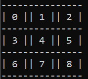

# The Minimax Aglorithm  - Using it to create an unbeatable AI Agent
For this project, I will be implementing the Minimax algorithm for the 2-player game [tic-tac-toe](https://en.wikipedia.org/wiki/Tic-tac-toe).

#### The Agent
The agent has no depth restrictions (hopefully your machine won't be ancient) and uses a simple Minimax implementation. 

#### Program
You can run the program by using the call `python main.py`

After that, the program will ask if you would like to Cross `X` (player 1) or Naughts `O` (player 2).

For each turn, you will be asked an input (between 0 - 8) to place your piece on the board. Here's the board layout:



I hope you enjoy playing against the AI :) (it should be unbeatable but let's see).

#### Minimax Algorithm
The following pseudocode was used for implementation:
```
function minimax(node, depth, maximizingPlayer) is
    if depth = 0 or node is a terminal node then
        return the heuristic value of node
    if maximizingPlayer then
        value := −∞
        for each child of node do
            value := max(value, minimax(child, depth − 1, FALSE))
        return value
    else (* minimizing player *)
        value := +∞
        for each child of node do
            value := min(value, minimax(child, depth − 1, TRUE))
        return value
```

#### Future Implementation
- Add a dificulty setting (by limiting depth)
- Make the board interactive through a nice UI (pygame)
